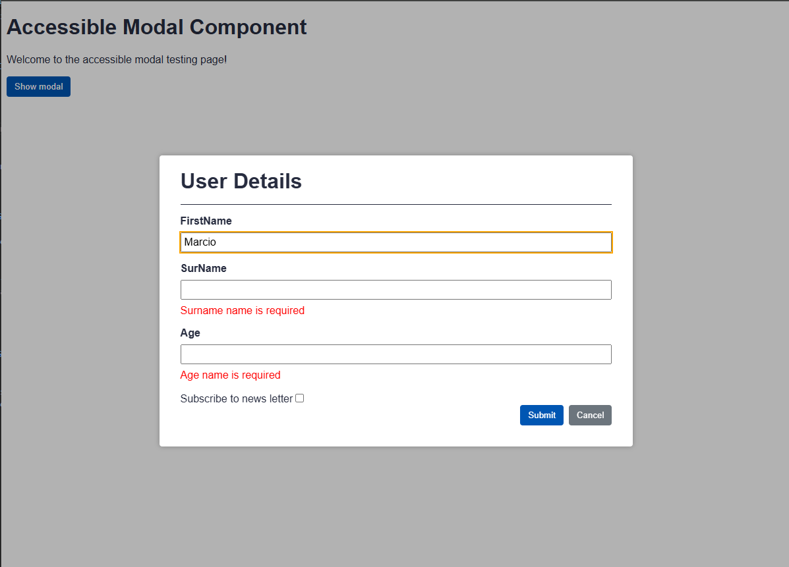

# 🚀 a11y-p2: Aplicação Angular com Acessibilidade

Este projeto demonstra a implementação de um modal acessível em Angular, com foco em boas práticas de acessibilidade (a11y), uso de animações, formulários reativos e gerenciamento de foco.

---

## 🛠️ Tecnologias Utilizadas

- **Angular 10**
- **TypeScript**
- **SCSS**
- **Reactive Forms**
- **Animações Angular**
- **Acessibilidade (a11y)**

---

## 📦 Instalação

1. **Clone o repositório:**
   ```sh
   git clone https://github.com/marcionavarro/alura-angular
   cd a11y-p2
   ```

2. **Instale as dependências:**
   ```sh
   npm install
   ```
---

## ▶️ Como Rodar a Aplicação

Execute o comando abaixo para iniciar o servidor de desenvolvimento:

```sh
npm start
```

Acesse no navegador: [http://localhost:4200](http://localhost:4200)

---

## 🖼️ Screenshots

| Modal Aberto |
|--------------|
|  
---

## ♿ Sobre Acessibilidade

- Modal com foco gerenciado e fechamento por teclado
- Labels e mensagens de erro acessíveis por leitores de tela
- Uso de `aria-*` para melhor experiência assistiva
