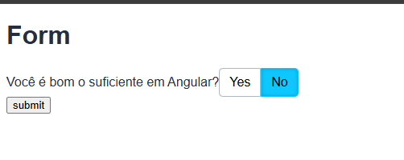

# ♿️ A11yP1

Projeto de exemplo focado em **acessibilidade** com Angular.

## 🚀 Sobre o projeto

Este sistema demonstra boas práticas de acessibilidade em aplicações Angular, incluindo componentes acessíveis, navegação por teclado e gerenciamento de foco.

## 🛠️ Tecnologias Utilizadas

-  **Angular 10**
-  **TypeScript**
-  **SCSS**
-  **RxJS**

## ✨ Funcionalidades

- Grupo de botões Sim/Não acessível, com navegação por teclado
- Diretivas customizadas para foco e acessibilidade
- Formulários reativos acessíveis


## 📸 Screenshot



## 📥 Como clonar o projeto

```sh
git clone https://github.com/marcionavarro/alura-angular.git
cd a11y
```

## 📦 Como rodar o projeto

```sh
npm install
npm start
```
Acesse [http://localhost:4200](http://localhost:4200) no navegador.


## 📁 Estrutura

- `src/app/shared/components` — Componentes reutilizáveis
- `src/app/shared/directives` — Diretivas de acessibilidade


Projeto criado com [Angular CLI](https://github.com/angular/angular-cli).
