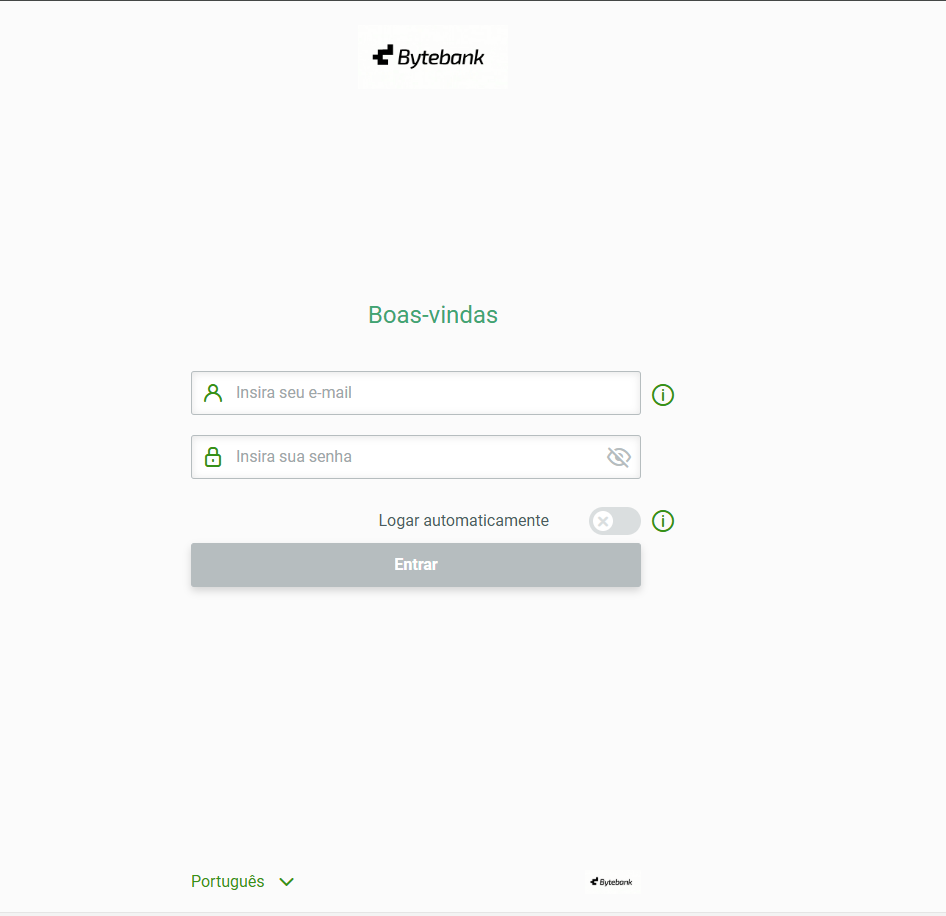
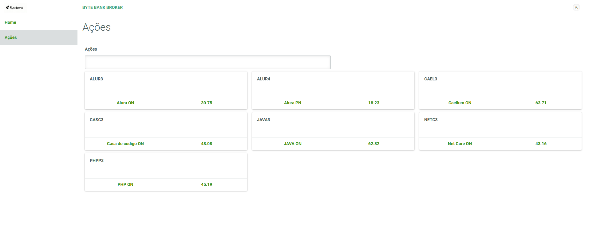
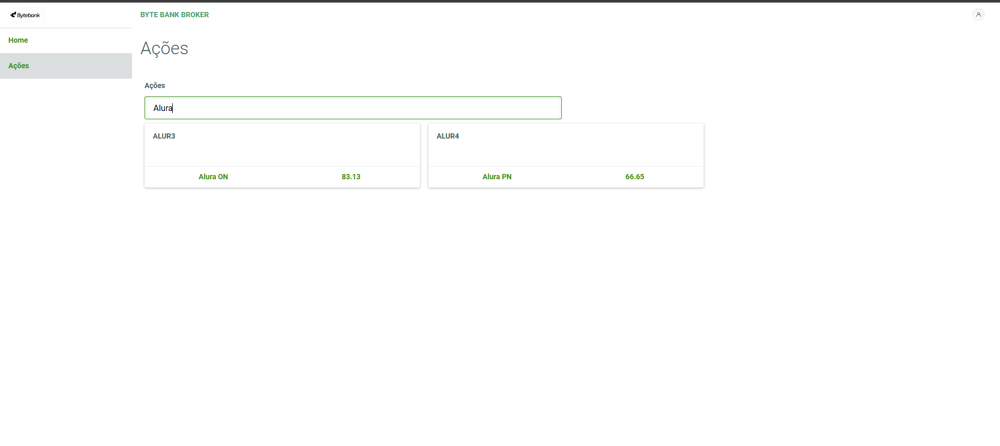

# 📈 alura_angular_rxjs_1

Bem-vindo ao **alura_angular_rxjs_1**!  
Este projeto demonstra conceitos de Angular e RxJS, incluindo consumo de APIs, manipulação reativa de dados e autenticação JWT. O backend é feito em Node.js com Express.

---

## 🚀 Tecnologias Utilizadas

- 
- 
-  
- 
-  


---

## ⚙️ Pré-requisitos

- **Node.js** versão **14.x**  
  Verifique sua versão com:
  ```sh
  node -v
  ```
  Caso necessário, instale pelo [site oficial](https://nodejs.org/en/download/releases/).

- **npm** (geralmente já incluso com o Node.js)

---

## 📦 Como Instalar e Rodar o Projeto

1. **Clone o repositório:**
   ```sh
   git clone https://github.com/marcionavarro/alura-angular
   cd alura_angular_rxjs
   ```

2. **Instale as dependências do backend:**
   ```sh
   cd api
   npm install
   ```

3. **Inicie o backend:**
   ```sh
   node server.js || npm start
   # O backend estará disponível em http://localhost:3000
   ```

4. **Instale as dependências do frontend:**
   ```sh
   cd byte-bank-broker
   npm install
   ```

5. **Inicie o frontend Angular:**
   ```sh
   ng serve || npm start
   # O sistema estará disponível em http://localhost:4200
   ```

---

## 🖼️ Screenshots

| Tela de Login | Tela de Listagem | Tela de pesquisa |
|:-------------:|:----------------:|:----------------:|
|  |  |  |

---