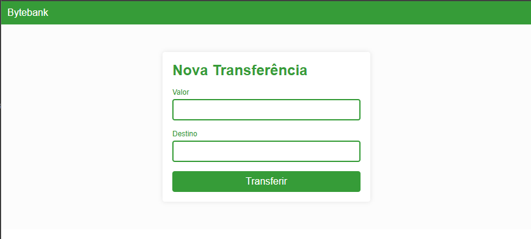

# 💸 Bytebank

Bem-vindo ao **Bytebank**! Este é um sistema desenvolvido para gerenciar transações bancárias de forma simples e intuitiva, utilizando as melhores práticas do Angular.

---

## 🚀 Sobre o Projeto

O Bytebank é uma aplicação web que permite o cadastro e visualização de transações financeiras. O objetivo é demonstrar conceitos fundamentais do Angular, como componentes, serviços, diretivas e integração com APIs.

---

## 🛠️ Tecnologias Utilizadas

- [Angular](https://angular.io/)  
- [TypeScript](https://www.typescriptlang.org/)  
- [RxJS](https://rxjs.dev/) 
- [Node.js](https://nodejs.org/) 
- [json-server](https://github.com/typicode/json-server) (API fake para simular backend)

---

## 🖥️ Screenshots

| Tela de Transações | Tela de Adicionar Transação |
|---------------|-------------------|
|  |  |

---

## 📦 Como Instalar e Rodar o Projeto

1. **Clone o repositório:**
   ```bash
   git clone https://github.com/marcionavarro/alura-angular
   cd bytebank
   ```

2. **Instale as dependências:**
   ```bash
   npm install
   ```

3. **Instale o json-server globalmente (caso não tenha):**
   ```bash
   npm install -g json-server
   ```

4. **Inicie o json-server com o arquivo de dados (exemplo: `db.json`):**
   ```bash
   json-server --watch db.json --port 3000
   ```
   O backend fake estará disponível em [http://localhost:3000](http://localhost:3000).

5. **Execute o servidor de desenvolvimento Angular:**
   ```bash
   ng serve
   ```
   O sistema estará disponível em [http://localhost:4200](http://localhost:4200).


## 📄 Licença

Este projeto está sob a licença MIT.
