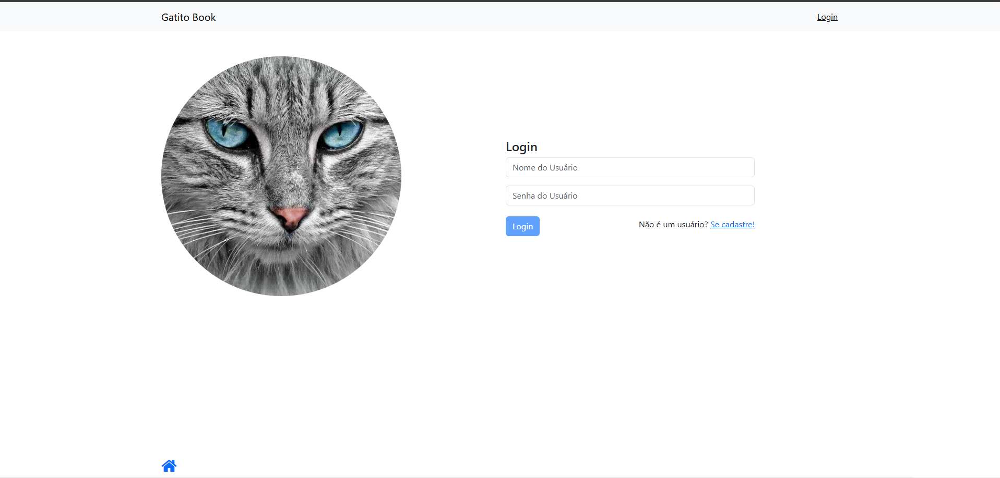
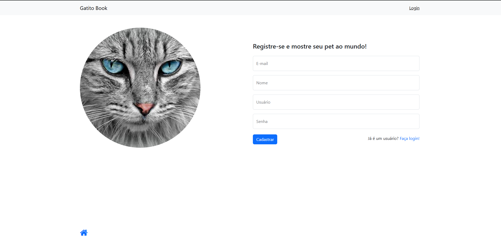
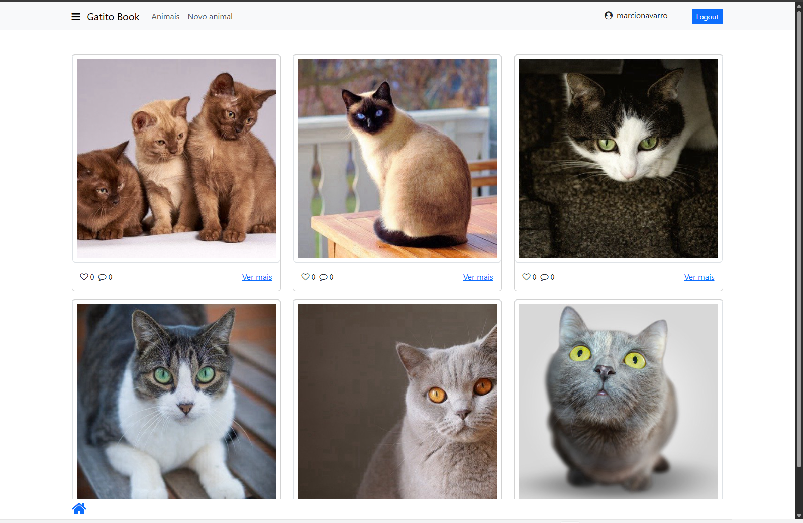
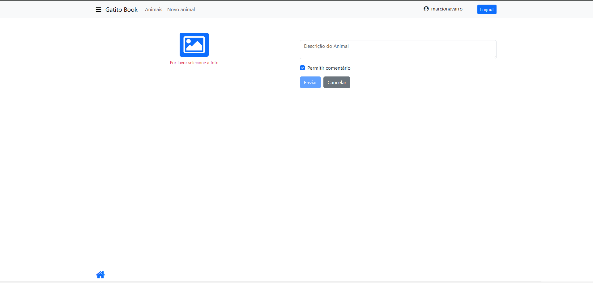
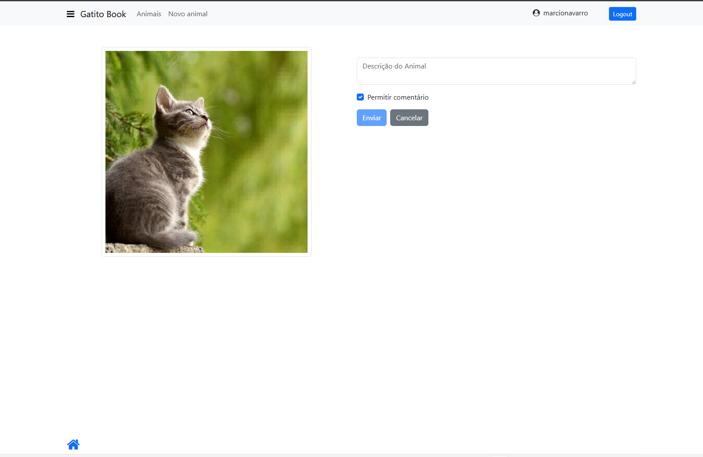

# 🐾 Gatitobook

Bem-vindo ao **Gatitobook**! Um projeto desenvolvido com Angular para compartilhar fotos de pets, permitindo cadastro de usuários, upload de imagens e comentários.

---

## 📚 Sobre o Projeto

O **Gatitobook** é uma rede social para amantes de animais, onde usuários podem criar contas, fazer login, postar fotos dos seus pets e interagir com outros usuários através de comentários. O projeto utiliza Angular no frontend e Node.js no backend, com autenticação JWT e upload de imagens.

---

## 🚀 Tecnologias Utilizadas

- [Angular](https://angular.io/)  
- [TypeScript](https://www.typescriptlang.org/)  
- [RxJS](https://rxjs.dev/)  
- [Node.js](https://nodejs.org/) (versão 14.x recomendada)  
- [Express](https://expressjs.com/)  
- [Multer](https://github.com/expressjs/multer) (upload de imagens)  
- [Jimp](https://github.com/jimp-dev/jimp) (processamento de imagens)  
- [JWT](https://jwt.io/) (autenticação)  

---

## 🖼️ Screenshots

| Tela de Login | Cadastro de Novo Usuário | Tela de animais |
|---------------|-----------------|-------------------------|
|  |  |  |

| Cadastro de Animal | Cadastro de Animal com preview
|---------------|-----------------
|   |  

---
## ⚙️ Pré-requisitos

- **Node.js** versão **14.x**  
  Verifique sua versão com:
  ```sh
  node -v
  ```
  Caso necessário, instale a versão 14 do Node.js pelo [site oficial](https://nodejs.org/en/download/releases/).

- **npm** (geralmente já incluso com o Node.js)

---

## 📦 Como Instalar e Rodar o Projeto

1. **Clone o repositório:**
   ```sh
   git clone https://github.com/marcionavarro/alura-angular
   cd gatitobook
   ```

2. **Instale as dependências do frontend:**
   ```sh
   npm install
   ```

3. **Instale as dependências do backend:**
   ```sh
   cd api
   npm install
   ```

4. **Inicie o backend:**
   ```sh
   cd api
   node server.js
   # O backend estará disponível em http://localhost:3000
   ```

5. **Inicie o frontend Angular:**
   ```sh
   ng serve
   # O sistema estará disponível em http://localhost:4200
   ```

---

## 📄 Licença

Este projeto está sob a licença MIT.
