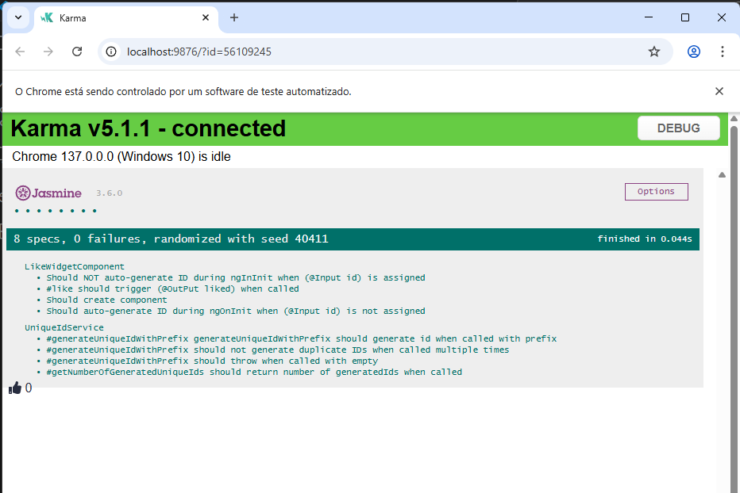

# 🚀 NgTest1

NgTest1 é uma aplicação Angular criada para demonstrar práticas modernas de desenvolvimento front-end, incluindo testes unitários, componentização e uso de bibliotecas populares como FontAwesome. O projeto utiliza Angular CLI para scaffolding, Karma/Jasmine para testes e segue boas práticas de organização de código.

---

## 🛠️ Tecnologias Utilizadas

- **Angular 11**  
- **TypeScript**
- **SCSS**
- **FontAwesome**
- **Jasmine & Karma** (testes unitários)
- **Protractor** (testes E2E)
- **uuid** (geração de IDs únicos)

---

## 📦 Instalação

1. **Clone o repositório**
   ```sh
   git clone https://github.com/marcionavarro/alura-angular.git
   cd ng-test1
   ```

2. **Instale as dependências**
   ```sh
   npm install
   ```

---

## ▶️ Como rodar a aplicação

- **Servidor de desenvolvimento**
  ```sh
  npm start
  ```
  Acesse [http://localhost:4200](http://localhost:4200) no navegador.

- **Rodar testes unitários**
  ```sh
  npm test
  ```

- **Rodar testes E2E**
  ```sh
  npm run e2e
  ```

- **Build de produção**
  ```sh
  npm run build
  ```

---

## 🖼️ Screenshots

Adicione aqui imagens da aplicação em funcionamento:

| Página Inicial 
|:--------------:
| 

---

## 💡 Observações

- O projeto já vem configurado com testes unitários e E2E.
- Para mais informações, consulte a [documentação oficial do Angular CLI](https://angular.io/cli).

```